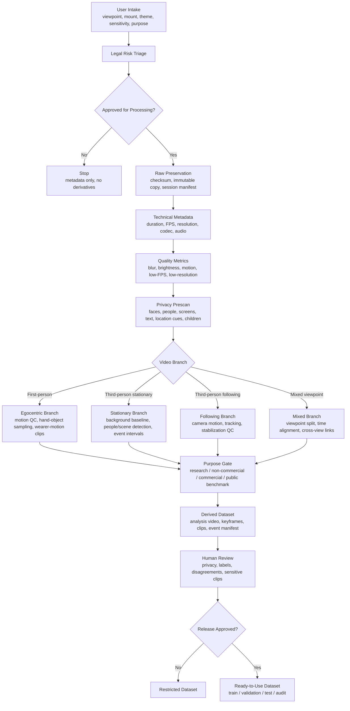

# Golden Standard Video Preprocessing Toolkit

Last updated: 2026-07-14

This toolkit is designed for users and developers who receive videos from individuals and need a consistent way to decide what preprocessing is required before research, non-commercial, or commercial use.

The core idea is simple: users should first log what kind of video they have, what it contains, where it was filmed, and why it is being processed. The toolkit then chooses a legal-first preprocessing chain.

## User Intake Questionnaire

Every video should be logged with the following fields before preprocessing:

| Field | Example Values | Why It Matters |
| --- | --- | --- |
| Viewpoint | `first_person`, `third_person`, `mixed`, `screen_recording`, `unknown` | Determines motion handling, privacy risk, and feature extraction |
| Mount / capture position | `glasses`, `headwear`, `chest`, `handheld`, `stationary_camera`, `following_camera`, `vehicle`, `drone` | Determines stabilization, field-of-view assumptions, and event boundaries |
| Camera motion | `stationary`, `following`, `wearer_motion`, `handheld`, `vehicle_motion` | Determines sampling and motion-quality checks |
| Filming theme | `daily_people`, `children`, `nature`, `workplace`, `clinical`, `education`, `sports`, `driving`, `public_space`, `private_home`, `industrial` | Determines legal risk, privacy scans, and annotation schema |
| Location sensitivity | `low`, `medium`, `high` | Determines release and redaction strictness |
| Purpose | `research`, `non_commercial`, `commercial`, `internal_testing`, `public_benchmark` | Determines consent, license, and release gates |
| People present | true/false | Triggers face/body/bystander review |
| Audio present and approved | true/false | Determines whether audio is stripped or processed |
| Children/minors present | true/false | Triggers red-level review |
| Health/clinical context | true/false | Triggers red-level review |
| Biometrics/emotion inference | true/false | Triggers red-level review |

The starter JSON template is:

```text
configs/video_profile_template.json
```

## Golden Standard Pipeline



## Branch Logic by Video Type

| Video Type | Default Processing Chain | Extra Requirements |
| --- | --- | --- |
| First-person glasses/headwear | Legal gate, raw hash, metadata, motion QC, keyframes, fixed-window clips, hand-object candidate sampling, privacy scan | Strong bystander policy; audio off unless approved |
| First-person chest-mounted | Legal gate, raw hash, metadata, lower-body/hand-object sampling, motion QC, keyframes/clips | Different field-of-view assumptions from glasses |
| Third-person stationary camera | Legal gate, raw hash, metadata, background baseline, people/scene detection, event interval detection | High surveillance risk if public/workplace |
| Third-person following camera | Legal gate, raw hash, metadata, camera-motion assessment, subject tracking, stabilization QC | Consent from followed subject and bystanders |
| Mixed viewpoint | Legal gate, raw hash, metadata, viewpoint separation, timestamp alignment, cross-view event IDs | Must prevent leakage across train/test splits |
| Nature / low people | Legal gate, raw hash, metadata, scene sampling, quality metrics, optional object/animal/environment labels | Lower legal risk unless location is sensitive |
| Children / school | Legal/IRB gate, parental consent, restricted storage, face/audio redaction, human review | No public raw release by default |
| Clinical / health | Legal/IRB/HIPAA-style review, restricted storage, audio/location controls, human review | Treat derived captions and embeddings as sensitive |
| Workplace / commercial | Employment/privacy/legal review, restricted access, clear purpose limitation | Avoid surveillance and productivity inference without explicit approval |

## Purpose-Based Rules

| Purpose | Default Rule |
| --- | --- |
| Research | Consent and ethics review first; derived restricted dataset unless release is approved |
| Non-commercial | Consent and license terms still required; avoid public raw release |
| Commercial | Strongest review: purpose limitation, data-use terms, privacy impact assessment, deletion workflow |
| Internal testing | Use synthetic/public/consented data first; do not mix with release datasets |
| Public benchmark | Only release explicitly consented, de-identified, audited data with a data card |

## Tool Categories

| Stage | Tool Category | Examples |
| --- | --- | --- |
| Metadata | Media probing | `ffprobe`, ExifTool |
| Derivatives | Media processing | `ffmpeg` |
| Quality metrics | Computer vision | OpenCV, NumPy |
| Privacy scan | Detection/redaction | face/text/screen/person detectors |
| First-person features | Egocentric modeling | hand-object detection, motion-aware sampling, VideoMAE/SlowFast-style embeddings |
| Third-person features | Scene/person analysis | person detection, tracking, background baseline, event intervals |
| Annotation | Human review | CVAT, Label Studio |
| Dataset QA | Curation | FiftyOne, Parquet/JSONL manifests |
| Release | Governance | data card, license, audit log, deletion and retention policy |

## Current Script Support

The current script supports the first operational slice of this toolkit:

```bash
python3 pipeline/egocentric_preprocess.py sample.mp4 \
  --output-dir preprocessing_runs \
  --profile-json configs/video_profile_template.json \
  --dry-run
```

Developers can also pass the fields directly:

```bash
python3 pipeline/egocentric_preprocess.py sample.mp4 \
  --output-dir preprocessing_runs \
  --viewpoint first_person \
  --mount glasses \
  --camera-motion wearer_motion \
  --filming-theme daily_people \
  --location-sensitivity medium \
  --purpose research \
  --contains-people \
  --contains-bystanders \
  --consent-approved
```

The script then writes a processing plan containing:

- `video_type`
- `profile`
- `legal_risk_level`
- `pipeline_chain`
- `required_processing`
- `prohibited_or_deferred_processing`
- `reasons`

## What Still Needs Implementation

- Automatic face, text, screen, and person detection.
- Scene-change sampling beyond fixed intervals.
- Label Studio or CVAT task export.
- First-person hand-object feature extraction.
- Third-person tracking and background-change analysis.
- Dataset assembler for train/validation/test/audit splits.
- Data-card generator and release checklist.
