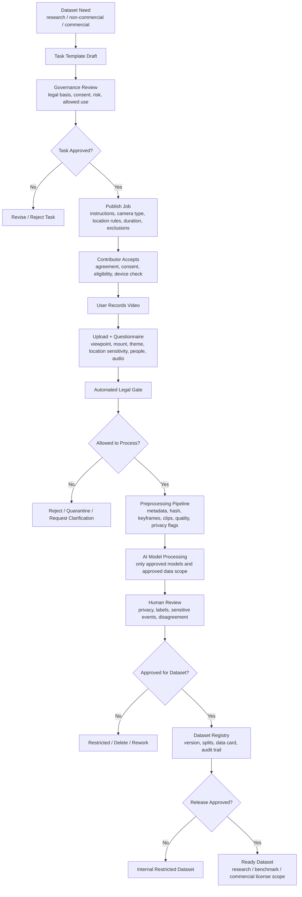

# Governed Video Data Platform Blueprint

Last updated: 2026-07-14

This blueprint describes how the toolkit can become a governed platform where organizations assign filming jobs, contributors upload videos, reviewers approve data, and the system produces legally safer datasets for AI model development.

This is a product and technical governance design, not legal advice. A real deployment needs counsel, ethics/IRB review when applicable, security review, and jurisdiction-specific policy.

## Platform Purpose

The platform should not be a generic place where anyone uploads arbitrary videos. It should be a governed data-collection system where each uploaded video is tied to:

- A specific filming task.
- A contributor identity or pseudonymous contributor ID.
- Consent and contributor agreement version.
- Capture instructions.
- Allowed and prohibited uses.
- Legal risk classification.
- Preprocessing and AI model permissions.
- Human review status.
- Dataset release status.
- Retention and deletion obligations.

## Core Roles

| Role | What They Can Do | What They Cannot Do by Default |
| --- | --- | --- |
| Platform admin | Configure policies, roles, retention, integrations, audit exports | View raw sensitive video without separate permission |
| Legal/governance officer | Approve task templates, consent text, release levels, data-use terms | Change model outputs or reviewer labels |
| Research/product owner | Propose data collection jobs and define target dataset needs | Launch high-risk jobs without governance approval |
| Task designer | Write filming instructions, camera/mount requirements, quality criteria | Bypass legal gates |
| Contributor/uploader | Accept assigned jobs, record and upload videos, complete context questionnaire | Upload outside allowed task scope |
| Privacy reviewer | Review faces, screens, children, bystanders, location cues, audio risk | Approve final dataset release alone |
| Label reviewer | Correct labels, event boundaries, scene/action categories | Override legal restrictions |
| Model operator | Run approved preprocessing/model jobs | Run unapproved external models on restricted data |
| Dataset curator | Assemble train/validation/test/audit splits and data cards | Include unapproved videos in release datasets |

## End-to-End Platform Flow



## Job Template Data Model

Every filming job should be defined before contributors can upload.

```json
{
  "job_id": "job_2026_001",
  "title": "First-person indoor daily activity with no children",
  "purpose": "research",
  "viewpoint_required": "first_person",
  "mount_required": "glasses_or_headwear",
  "duration_seconds_min": 120,
  "duration_seconds_max": 300,
  "allowed_locations": ["private_home_with_consent", "controlled_lab"],
  "prohibited_content": ["children", "medical_events", "screens_with_personal_data"],
  "audio_policy": "disabled",
  "bystander_policy": "avoid_or_obtain_permission",
  "external_model_processing": false,
  "release_level": "restricted_research",
  "consent_version": "consent_v1",
  "review_required": ["privacy", "label", "governance"]
}
```

## Upload Questionnaire

The upload form should require structured answers before the file is accepted:

- Viewpoint: first-person, third-person, mixed, screen recording, unknown.
- Mount: glasses, headwear, chest, handheld, stationary camera, following camera, vehicle, drone.
- Camera motion: stationary, following, wearer motion, handheld, vehicle motion.
- Theme: daily people, children, nature, workplace, clinical, education, sports, driving, public space, private home, industrial.
- Location sensitivity: low, medium, high.
- Purpose: research, non-commercial, commercial, internal testing, public benchmark.
- People present.
- Bystanders present.
- Children/minors present.
- Health or clinical context.
- Audio recorded.
- Screens, names, addresses, license plates, IDs, or confidential workplace content visible.
- Contributor confirms they followed the task instructions.
- Contributor confirms they have permission to upload under the stated terms.

## Data States

The platform should treat video data as moving through controlled states.

| State | Meaning | Allowed Actions |
| --- | --- | --- |
| `draft_job` | Task template not approved | Edit only |
| `approved_job` | Contributors can accept task | Assign, record, upload |
| `uploaded_pending_gate` | File uploaded but not processed | Virus scan, metadata, legal gate |
| `quarantined` | Legal/technical issue | Admin/governance review only |
| `preprocessing_allowed` | Consent and policy allow local processing | Metadata, hash, keyframes, clips |
| `model_allowed_private` | Private/local AI allowed | Approved private model inference |
| `model_allowed_external` | External/cloud AI allowed | Approved vendor/API processing |
| `privacy_review` | Needs human privacy check | Reviewer annotation/redaction |
| `label_review` | Needs human label check | Event/scene/action labeling |
| `dataset_candidate` | Eligible for dataset assembly | Split, QA, data card |
| `restricted_dataset` | Internal use only | Controlled access |
| `release_approved` | Public/partner release approved | Export under license |
| `deletion_required` | Withdrawal, expiry, or violation | Delete according to policy and log |

## Governance Gates

### Gate 1: Task Approval

Before a job is published:

- Confirm legal basis and jurisdiction.
- Confirm whether children, health, workplace, school, public-space, biometric, or emotion inference risks are present.
- Approve consent language and contributor agreement.
- Define allowed use, prohibited use, and retention period.
- Define whether raw video, derived clips, embeddings, captions, and labels can be used.

### Gate 2: Upload Acceptance

Before preprocessing:

- Confirm uploader accepted the correct task and agreement.
- Confirm file matches task scope.
- Confirm questionnaire does not contradict task restrictions.
- Reject or quarantine if children, health context, bystanders, screens, or audio violate task terms.

### Gate 3: Model Processing

Before AI inference:

- Determine whether private/local models only, approved cloud models, or external APIs are allowed.
- Prevent restricted raw videos from leaving the approved environment.
- Record model name, model version, prompt/config version, and output type.
- Block biometric identification, emotion inference, or medical inference unless explicitly approved.

### Gate 4: Dataset Assembly

Before a video enters a dataset:

- Ensure privacy review is complete.
- Ensure label review is complete.
- Ensure train/validation/test split avoids contributor, household, location, and task leakage.
- Ensure embeddings/captions are treated as potentially identifying.
- Generate a data card and known-limits report.

### Gate 5: Release

Before release:

- Confirm release level matches consent and job terms.
- Confirm removal or restriction of raw video/audio if not approved.
- Confirm license/data-use agreement.
- Confirm deletion and withdrawal process.
- Confirm audit trail is exportable.

## Security Requirements

- Role-based access control.
- Least-privilege raw video access.
- Encryption at rest and in transit.
- Audit logs for every raw/derived media access.
- Separate raw vault from derived dataset workspace.
- Secret management for model/vendor keys.
- Signed URLs with expiration for uploads/downloads.
- Malware scanning on upload.
- Immutable provenance: hashes, model versions, reviewer IDs, timestamps.
- Retention jobs that automatically flag or delete expired data.

## Model Implementation Layer

AI should be modular and policy-controlled.

| Model Task | Example Output | Governance Concern |
| --- | --- | --- |
| Viewpoint classification | first-person, third-person, mixed | Low risk, useful for routing |
| Camera motion classification | stationary, following, high-motion | Low risk, useful for preprocessing |
| Scene classification | kitchen, street, workplace, clinic | May reveal sensitive places |
| Person/face detection | people present, face boxes | Privacy-sensitive |
| Screen/text detection | screen/text regions | Can expose private data |
| Hand-object detection | active object, interaction | Useful for first-person tasks |
| Temporal segmentation | event start/end | Needed for datasets |
| Embeddings | vector search features | Potentially re-identifying |
| Captioning | natural language summaries | Can leak names, health, location |
| Emotion/biometric inference | stress/emotion/identity | High-risk; blocked by default |

## Minimal MVP

The first platform version should include:

- Admin-created job templates.
- Contributor task acceptance and upload.
- Required upload questionnaire.
- Legal gate using the existing profile logic.
- Local preprocessing worker using `pipeline/egocentric_preprocess.py`.
- Reviewer dashboard for privacy and labels.
- Dataset registry with restricted exports only.
- Audit log and deletion workflow.

The MVP should not include public dataset release, external model APIs, biometric identification, emotion inference, or commercial licensing until governance review is mature.

## Practical Rule

The platform should never ask "can we process this video?" after upload as an afterthought. It should know the allowed uses before assignment, verify them at upload, enforce them at preprocessing, and preserve them in every dataset version.
