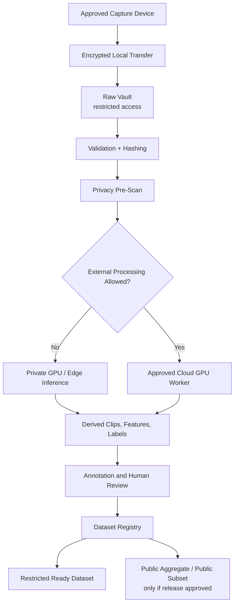

# Hardware and Software Setup for Egocentric Video Preprocessing

Last updated: 2026-07-13

This guide specifies the minimum hardware and software needed to move from first-person capture to a legally reviewable, ready-to-use dataset. The setup is organized by deployment tier because a small pilot, a research study, and a production AI-glasses pipeline should not use the same infrastructure.

## Setup Principle

Do not start with the camera. Start with the legal and data-governance setup. For egocentric video, the hardware is easy to buy; the hard part is controlling consent, bystanders, audio, location, biometric inference, health context, retention, deletion, and dataset release.

## Minimum Legal and Governance Setup

Required before capture:

- Consent form and protocol describing video, audio, location, IMU, gaze, physiology, and derived AI labels.
- Bystander policy: no capture, visible notice, consent zones, or mandatory redaction.
- Child/minor policy: parental consent and child assent when applicable.
- Audio policy: jurisdiction-specific review for one-party or all-party consent.
- Health/physiology policy: HIPAA or health-data review when medical or biological signals are linked.
- Biometric/emotion policy: explicit decision on whether face ID, voice ID, gait, gaze, or emotion inference is prohibited, restricted, or approved.
- Retention and withdrawal workflow: what gets deleted, what gets retained for audit, and how derived embeddings are handled.
- Data release level: raw closed, derived restricted, public aggregate, or public benchmark subset.

Required metadata fields:

```text
session_id
participant_id_or_pseudonym
consent_version
capture_context
jurisdiction
bystander_notice_status
audio_recording_allowed
location_precision_allowed
minor_or_child_data_flag
health_data_flag
biometric_processing_flag
emotion_inference_flag
external_model_use_allowed
retention_period
withdrawal_process
release_level
```

## Hardware Tiers

### Tier 0: Desk Prototype

Use this for pipeline debugging without sensitive human data.

| Component | Recommended Setup | Purpose |
| --- | --- | --- |
| Camera | Laptop webcam or USB webcam | Test ingestion, frame sampling, metadata flow |
| Compute | Laptop or desktop | Run scripts, FFmpeg, small models |
| Storage | Local encrypted folder | Prototype manifests and sample clips |
| Data | Synthetic video or public benchmark clips | Avoid legal exposure during development |

Best for: checking file formats, metadata schema, annotation UI, and dataset packaging.

### Tier 1: Controlled Research Pilot

Use this for adult participants in a lab or controlled room.

| Component | Recommended Setup | Purpose |
| --- | --- | --- |
| First-person camera | Action camera, phone chest/head mount, or research wearable camera | Stable egocentric video capture |
| Optional AI glasses | Only if legal/IRB review approves bystander and audio risks | Naturalistic glasses-like viewpoint |
| Microphone | Off by default; enable only when approved | Avoid accidental speech capture |
| IMU | Phone, wearable, or camera IMU metadata | Motion quality and synchronization |
| Time sync | NTP-synced phone/laptop clock or visible clap/sync marker | Align video, labels, and physiology |
| Edge compute | Laptop or small workstation | Copy, hash, inspect, and encrypt recordings |
| Storage | Encrypted SSD plus encrypted backup | Field transfer and raw-data protection |

Best for: collecting initial first-person samples, validating consent workflows, estimating storage, and testing human annotation.

### Tier 2: Research-Grade Multimodal Collection

Use this when linking video to gaze, physiology, child/caregiver behavior, health, or long daily-life sessions.

| Component | Recommended Setup | Purpose |
| --- | --- | --- |
| Capture device | AI/AR glasses, action camera, or head-mounted camera with visible recording indicator | Natural first-person view |
| Secondary camera | Room camera or observer camera when approved | Ground truth and safety audit |
| Depth/vision module | OAK-D/Luxonis-style RGB-depth camera for controlled rigs | Depth, stereo, hand-object geometry |
| Edge AI computer | NVIDIA Jetson Orin Nano-class device or laptop GPU | On-device redaction, keyframes, quality scoring |
| Physiological sensors | HR/HRV, EDA, respiration, actigraphy, sleep, or wearable sensor export | Biological alignment |
| Gaze | Eye tracker or gaze-capable headset when approved | Attention and visual-field inference |
| Time sync | Shared clock, NTP, BLE timestamps, or explicit sync event | Multimodal alignment |
| Secure storage | Encrypted NAS or cloud bucket with access logging | Restricted raw and derived data |

Best for: developmental, physiological, clinical, training, and human factors research.

### Tier 3: Production / Cloud-Scale Pipeline

Use this only after legal review, security review, and reproducibility requirements are stable.

| Component | Recommended Setup | Purpose |
| --- | --- | --- |
| Capture fleet | Managed devices with firmware/version inventory | Reproducible data collection |
| Device management | MDM or fleet management | App updates, encryption, remote wipe |
| Edge preprocessing | On-device keyframes, blur/exposure/motion scores, privacy filters | Reduce upload volume and legal risk |
| Cloud object storage | Versioned private bucket | Raw and derived media |
| Queue system | Event queue for ingestion and processing | Scalable pipeline orchestration |
| GPU workers | Cloud GPU or private GPU servers | Video embeddings, VLM classification, segmentation |
| Annotation system | CVAT or Label Studio with access control | Human review and active learning |
| Dataset curation | FiftyOne or equivalent dataset browser | QA, filtering, error analysis |
| Registry | Model, prompt, dataset, and schema versioning | Audit and reproducibility |
| Monitoring | Access logs, job logs, failure alerts, data-retention jobs | Legal and operational accountability |

Best for: multi-participant datasets, recurring data collection, and managed model-training releases.

## Software Stack

### Capture and Transfer

- Device app or camera companion app for recording.
- FFmpeg for transcoding, frame extraction, clips, and media validation.
- ExifTool or equivalent metadata extractor for device timestamps and file metadata.
- Cryptographic hash tooling such as SHA-256 for provenance.
- Encrypted transfer to local storage or cloud object storage.

### Privacy and Redaction

- Face, screen, text, badge, license plate, child, and location-cue detectors.
- Audio stripping or voice redaction when audio is not legally approved.
- Manual privacy review queue for uncertain detections.
- Redaction log that records model version, timestamp, and reviewer.

### Feature Extraction and Classification

- PyTorch for model inference.
- OpenCV for image/video processing.
- MMAction2 or PyTorchVideo for action recognition and video understanding baselines.
- CLIP-style image-language embeddings for open-vocabulary retrieval.
- Video-language model runtime for selected clips, not unrestricted raw uploads.
- Vector index for clip/frame embeddings.

### Temporal Segmentation

- Fixed-window clip generator for baseline processing.
- Scene-change and motion-aware sampling.
- Temporal action localization models for event boundaries.
- Human correction layer for important event onsets/offsets.

### Annotation and Human Review

- CVAT for bounding boxes, segmentation, tracking, and frame/video annotation.
- Label Studio for flexible classification, event labels, text/audio review, and ML-assisted annotation.
- Reviewer agreement workflow with adjudication.
- Active learning queue for low-confidence or high-value clips.

### Dataset Curation and Packaging

- FiftyOne or equivalent for visual dataset inspection, embeddings, predictions, and error slicing.
- Parquet or JSONL manifests for sessions, samples, events, labels, and privacy audits.
- Dataset card and label schema.
- Participant-wise or site-wise split generator.
- Data versioning with DVC, lakeFS, Git LFS, or an internal dataset registry if media is large or restricted.

## Minimal Command-Line Tools

```text
ffmpeg
ffprobe
exiftool
python
opencv-python
pandas
pyarrow
torch
transformers
open_clip_torch or equivalent CLIP implementation
fiftyone
label-studio or cvat
```

On macOS, the basic media tools can be installed with:

```bash
brew install ffmpeg exiftool
```

Python dependencies for the starter preprocessing script are listed in `requirements-preprocessing.txt`.

## Recommended Cloud Services

The exact provider can be AWS, Azure, Google Cloud, Tencent Cloud, or a university/private cloud. The required capabilities are more important than the brand.

| Capability | Required Feature |
| --- | --- |
| Object storage | Private buckets, versioning, lifecycle policies |
| Identity and access | Role-based access, least privilege, audit logs |
| Compute | CPU workers for FFmpeg, GPU workers for models |
| Queue/orchestration | Upload-triggered jobs, retry, dead-letter queue |
| Database | Session/event metadata, consent scope, review status |
| Secret management | API keys, model vendor credentials, encryption keys |
| Logging | Access logs, inference logs, deletion logs |
| Backup | Encrypted, tested restore path |

## Reference Architecture



## Practical Starter Recommendation

For the first real pilot, use:

- One controlled adult recording setup.
- Audio disabled by default.
- Visible recording notice.
- Encrypted SSD for transfer.
- FFmpeg + Python/OpenCV for validation and clips.
- Local/private model inference first.
- Label Studio or CVAT for review.
- Parquet manifests for metadata.
- No public raw video release.

This gives enough infrastructure to test the science without prematurely creating an always-on surveillance dataset.

## References

- NVIDIA Jetson Orin Nano Super Developer Kit: https://www.nvidia.com/en-us/autonomous-machines/embedded-systems/jetson-orin/nano-super-developer-kit/
- Luxonis OAK-D Lite documentation: https://docs.luxonis.com/hardware/products/OAK-D%20Lite/
- Label Studio documentation: https://labelstud.io/guide/
- MMAction2 documentation: https://mmaction2.readthedocs.io/en/latest/
- PyTorchVideo: https://pytorchvideo.org/
- FiftyOne documentation: https://docs.voxel51.com/
