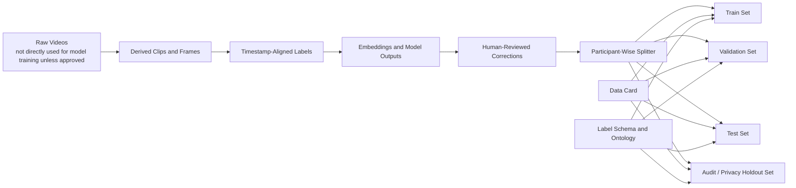

# Hardware-to-Ready Dataset Flowchart

Last updated: 2026-07-13

This flowchart turns the current egocentric-video literature review into an operational preprocessing path: from AI/AR glasses or wearable camera capture to a ready-to-use research or model-training dataset.

## End-to-End Flow

```mermaid
flowchart TD
    A0["Legal / Ethics / IRB Gate<br/>jurisdiction, consent, bystanders, children, health, biometrics, audio, location"] --> A{"Capture Legally Approved?"}
    A -->|"No or unclear"| A1["Stop / Redesign<br/>reduce modalities, change setting, remove audio, use benchmark or synthetic data"]
    A -->|"Yes"| B["Hardware Capture<br/>AI glasses / AR glasses / wearable camera / phone"]
    B --> C["On-Device Session Metadata<br/>timestamps, device ID, FPS, resolution, battery, IMU, optional GPS"]
    C --> D["Consent and Capture Governance<br/>participant ID, recording context, bystander policy, retention rules"]
    D --> E0{"Edge Preprocessing Needed?"}

    E0 -->|"Yes: privacy, bandwidth, or real-time need"| E["Lightweight Edge Preprocessing<br/>keyframes, blur score, exposure score, motion quality, optional face/screen blur"]
    E0 -->|"No: preserve raw signal"| F["Raw Upload Package<br/>video + metadata + sensor streams"]
    E --> F

    F --> G{"Upload and External Processing Allowed?"}
    G -->|"No"| G1["On-Device / Private Processing Only<br/>no third-party model or external cloud transfer"]
    G -->|"Yes"| H0["Secure Upload to Cloud Storage<br/>raw immutable object + manifest + checksum"]
    G1 --> H["Ingestion Validation<br/>file integrity, duration, codec, timestamps, consent flags"]
    H0 --> H
    H --> I{"Pass Legal + Technical Validation?"}
    I -->|"No"| I1["Quarantine / Legal Hold / Repair Queue<br/>missing metadata, corrupt files, consent mismatch"]
    I -->|"Yes"| J["Cloud Transcoding<br/>analysis MP4, preview MP4, standardized FPS/resolution"]

    J --> K["Frame and Clip Sampling<br/>uniform frames, scene-change frames, motion-aware clips, sliding windows"]
    K --> L["Privacy and Safety Detection<br/>faces, screens, text, children, location cues, medical/workplace sensitivity"]
    L --> M{"External or Shared Model Use Allowed?"}
    M -->|"No"| M1["Local/Private Inference Only<br/>restricted model runtime and storage"]
    M -->|"Yes"| N["Feature Extraction Queue"]
    M1 --> N

    N --> O["Visual Features<br/>RGB embeddings, VideoMAE/SlowFast-style clip features, CLIP-style frame embeddings"]
    N --> P["Interaction Features<br/>hands, active objects, object state, gaze if available"]
    N --> Q["Multimodal Features<br/>audio events, IMU motion, optional physiology alignment"]

    O --> R["Temporal Segmentation<br/>event boundaries, action starts/ends, scene transitions"]
    P --> R
    Q --> R

    R --> S["Open-Vocabulary and Taxonomy Classification<br/>coarse scene labels + fine event labels + VLM captions"]
    S --> T["Event Timeline Store<br/>timestamped events, labels, objects, confidence, model/prompt version"]
    T --> U["Human Review and Active Learning<br/>low confidence, sensitive clips, high-value labels, coder disagreement"]
    U --> V["Dataset Assembly<br/>splits, manifests, labels, embeddings, QA reports, data cards"]
    V --> W0{"Release Legally Approved?"}
    W0 -->|"No"| W1["Restricted Dataset Only<br/>internal use, data-use agreement, no public release"]
    W0 -->|"Yes"| W["Ready-to-Use Dataset<br/>training / validation / test / audit sets"]
```



## Data Products by Stage

| Stage | Main Artifact | Minimum Fields |
| --- | --- | --- |
| Hardware capture | Raw recording package | `session_id`, `device_id`, `start_time`, `end_time`, `fps`, `resolution`, `sensor_streams` |
| Governance | Consent manifest | `participant_id`, `study_id`, `allowed_uses`, `privacy_flags`, `retention_policy` |
| Edge preprocessing | Edge summary | `keyframe_paths`, `blur_score`, `exposure_score`, `motion_score`, `redaction_status` |
| Cloud ingestion | Immutable raw object | `storage_uri`, `checksum`, `upload_time`, `validation_status` |
| Transcoding | Analysis media set | `preview_uri`, `analysis_video_uri`, `codec`, `normalized_fps`, `duration` |
| Sampling | Frame/clip index | `sample_id`, `start_time`, `end_time`, `frame_uri`, `clip_uri`, `sampling_method` |
| Privacy detection | Privacy audit table | `sample_id`, `face_flag`, `screen_flag`, `text_flag`, `child_flag`, `review_required` |
| Feature extraction | Feature store | `sample_id`, `model_name`, `model_version`, `embedding_uri`, `feature_type` |
| Temporal segmentation | Event timeline | `event_id`, `start_time`, `end_time`, `boundary_confidence`, `source_model` |
| Classification | Label table | `event_id`, `coarse_scene`, `fine_action`, `active_objects`, `caption`, `confidence` |
| Human review | Reviewed labels | `event_id`, `human_label`, `reviewer_id`, `agreement_status`, `adjudication_notes` |
| Dataset assembly | Dataset release folder | `dataset_version`, `split`, `manifest`, `label_schema`, `data_card`, `known_limitations` |
| Legal release review | Release decision record | `release_level`, `allowed_uses`, `prohibited_uses`, `approver`, `approval_date`, `withdrawal_process` |

## Dataset Assembly Flow



## Recommended Folder Layout

```text
dataset_version/
  README.md
  DATA_CARD.md
  label_schema.json
  consent_scope_summary.json
  manifests/
    sessions.parquet
    samples.parquet
    events.parquet
    labels.parquet
    privacy_audit.parquet
  media/
    previews/
    clips/
    keyframes/
  features/
    visual_embeddings/
    audio_embeddings/
    hand_object_features/
  splits/
    train.txt
    validation.txt
    test.txt
    audit_holdout.txt
  qa/
    validation_report.json
    missingness_report.csv
    label_distribution.csv
    reviewer_agreement.csv
```

## Minimum Ready-to-Use Criteria

A dataset should not be treated as ready until it has:

- Legal/ethics approval for capture, processing, model inference, sharing, retention, and deletion.
- Raw-to-derived traceability from each frame, clip, feature, and label back to source timestamps.
- Participant-wise or site-wise splits that prevent identity and environment leakage.
- A documented label schema with coarse scene, fine action/event, active object, privacy, and review-status fields.
- Model and prompt version records for all automated labels and captions.
- Human review for sensitive, low-confidence, or theoretically important events.
- A data card describing capture devices, population, consent boundaries, known biases, missingness, and permitted uses.
- A release decision that distinguishes raw closed data, restricted derived data, and public aggregate or benchmark data.

## Practical Rule

The best early dataset is not the one with the most labels. It is the one where every label, embedding, clip, and event boundary can be traced, audited, and re-generated from the original capture under the participant's consent constraints.
