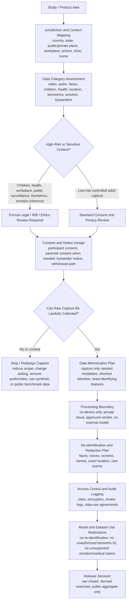

# Legal and Governance Checklist for Egocentric Video Datasets

Last updated: 2026-07-13

This document is a research and product-design checklist, not legal advice. First-person video can capture faces, voices, homes, workplaces, screens, children, health events, location traces, biometric identifiers, and emotional states. Legal review should happen before capture, before upload, before model inference, and before dataset release.

## Core Principle

For egocentric video, the legal object is not just the video file. It includes raw media, audio, metadata, location, gaze, IMU, derived embeddings, captions, emotion labels, biometric templates, face crops, object labels, transcripts, model outputs, and any dataset release that could allow re-identification.

## Legal-First Flow



## Stoplight Risk Triage

| Risk Level | Typical Case | Action |
| --- | --- | --- |
| Green | Adult participant records controlled tasks in a private lab with no bystanders and no audio | Standard consent, secure storage, clear retention, traceable preprocessing |
| Yellow | Adult daily-life recording with bystanders, homes, screens, location, or workplace content | Add bystander policy, redaction, restricted access, legal review before sharing |
| Red | Children, schools, clinics, patients, mental health, biometrics, emotion inference, public surveillance, law enforcement, or workplace monitoring | Formal legal/ethics review before capture; likely restricted or no public release |

## Legal Questions Before Hardware Capture

- Who is the participant, and who else may appear in the recording?
- Is the recording in a home, workplace, school, clinic, public place, vehicle, or private business?
- Will audio be recorded, and does the jurisdiction require one-party or all-party consent?
- Will children under 13 appear or be users of the system?
- Will the dataset include health information or be collected by/for a healthcare provider, insurer, school, or employer?
- Will the pipeline infer identity, emotion, stress, mental state, diagnosis, productivity, safety compliance, or biological state?
- Will faces, voices, gait, gaze, or other signals be used for biometric identification or categorization?
- Will raw data, derived clips, captions, embeddings, or labels be shared outside the original research team?
- Can a person withdraw, and what derived data must be deleted or retained for audit?

## Dataset Release Rules

Default to the most restrictive release that still supports the research purpose.

| Artifact | Recommended Default |
| --- | --- |
| Raw video and audio | Do not public-release; store in restricted access environment |
| Face crops, voices, screens, names, exact GPS | Remove, blur, transform, or keep restricted |
| Clip-level labels | Release only after privacy review and label audit |
| Embeddings | Treat as potentially re-identifying; restrict if derived from faces, voices, places, or rare events |
| Captions/transcripts | Review for names, addresses, health details, screens, and third-party speech |
| Aggregate statistics | Usually safest for public release |
| Public benchmark subset | Use only with explicit consent, strong de-identification, and documented data-use terms |

## Special Risk Areas

### Children and Families

If children are users or identifiable subjects, build around parental consent, child assent when appropriate, age-gating, retention limits, and deletion workflows. The FTC describes COPPA as giving parents control over what information websites and services can collect from children, and points to verifiable parental consent requirements.

### Health and Physiology

If egocentric video is linked to heart rate, HRV, EDA, respiration, sleep, clinical notes, diagnosis, therapy, hospital scenes, or patient context, treat it as potentially health-sensitive even when HIPAA does not formally apply. HHS guidance emphasizes that de-identified health information should not identify an individual and should not provide a reasonable basis to identify the individual.

### Biometrics, Emotion, and AI Glasses

Face recognition, voice identification, gait, iris, gaze, and emotion inference create heightened risk. The EU AI Act places transparency duties on deployers of emotion recognition or biometric categorization systems, and imposes strict conditions on real-time remote biometric identification in publicly accessible spaces.

### California and Other Privacy Laws

Under the CCPA/CPRA framework, personal information includes information that identifies, relates to, or could reasonably be linked with a person or household. Sensitive personal information includes precise geolocation, genetic data, biometric information processed to identify a consumer, health information, and other protected categories.

## Required Governance Metadata

Every dataset version should include:

```text
legal_basis_or_authorization
jurisdiction
capture_context
participant_consent_version
bystander_notice_policy
minor_or_child_data_flag
health_data_flag
biometric_processing_flag
emotion_inference_flag
audio_recording_flag
location_precision
allowed_uses
prohibited_uses
retention_period
withdrawal_process
redaction_status
external_model_use_allowed
data_release_level
reviewer_or_approver
approval_date
```

## Practical Design Rule

If a pipeline cannot answer "who consented, what was captured, where it was processed, what was derived, who accessed it, and what must be deleted on withdrawal," it is not ready for collection or release.

## Official References

- FTC Children's Privacy and COPPA guidance: https://www.ftc.gov/business-guidance/privacy-security/childrens-privacy
- HHS HIPAA de-identification guidance: https://www.hhs.gov/hipaa/for-professionals/special-topics/de-identification/index.html
- California CCPA overview: https://oag.ca.gov/privacy/ccpa
- EU Artificial Intelligence Act, Regulation (EU) 2024/1689: https://eur-lex.europa.eu/eli/reg/2024/1689/oj
