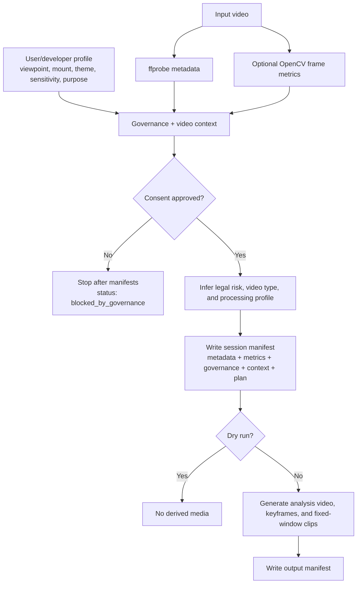

# Preprocessing Pipeline Logic

Last updated: 2026-07-14

This document defines the first operational script for the repository:

```text
pipeline/egocentric_preprocess.py
```

The script is intentionally local-first and legal-first. It does not upload videos, call external model APIs, or produce a public dataset by default. Its first job is to decide whether a video is allowed to be processed, what kind of video it appears to be, and which preprocessing profile should be used.

Although the file name still says `egocentric`, the current logic is broader: it accepts first-person, third-person, mixed-viewpoint, and unknown videos.

## Core Logic



## Tool Choices

| Tool or Package | Role | Required? |
| --- | --- | --- |
| `ffprobe` | Extract codec, duration, FPS, resolution, audio presence | Yes |
| `ffmpeg` | Transcode analysis video, extract keyframes, create clips | Yes for media derivatives |
| Python standard library | CLI, SHA-256 checksum, JSON manifests, subprocess orchestration | Yes |
| OpenCV / `opencv-python` | Sampled blur, brightness, and motion metrics | Optional but recommended |
| NumPy | Frame metric calculations | Optional with OpenCV |

This starter deliberately avoids model-heavy dependencies such as PyTorch, MMAction2, and video-language models. Those should be added only after legal approval, data-retention rules, and local manifests are stable.

## Video-Type Identification

The script uses rule-based classification from metadata, optional sampled-frame metrics, filename/context hints, and governance flags.

| Signal | Rule | Resulting Processing Implication |
| --- | --- | --- |
| `consent_approved=false` | Any video | Stop after metadata and governance manifests |
| Duration `>=600s` | Long untrimmed session | Use scene/keyframe sampling, fixed-window clips, temporal segmentation queue |
| Duration `<=30s` | Short clip | Dense keyframes and clip-level classification |
| High sampled frame difference | High motion first-person video | Add motion-aware sampling and stabilization quality flag |
| Low Laplacian blur score | Blurry video | Add blur quality flag and review queue |
| Resolution below 720p | Low-resolution video | Add low-resolution quality flag |
| FPS below 20 | Low-FPS video | Add low-FPS quality flag |
| Audio present but not approved | Audio governance issue | Strip audio from derivatives and defer transcription |
| Minors, health, biometrics, emotion inference | Sensitive research context | Restricted processing profile and manual legal/privacy review |
| Filename hints such as `clinic`, `school`, `child`, `therapy`, `home` | Possible sensitive context | Add filename-sensitive review flag |

## User/Developer Intake Fields

The toolkit supports direct CLI arguments or a questionnaire JSON file.

| Field | Supported Values |
| --- | --- |
| `viewpoint` | `first_person`, `third_person`, `mixed`, `screen_recording`, `unknown` |
| `mount` | `glasses`, `headwear`, `chest`, `handheld`, `vehicle`, `drone`, `stationary_camera`, `following_camera`, `unknown` |
| `camera_motion` | `stationary`, `following`, `wearer_motion`, `handheld`, `vehicle_motion`, `unknown` |
| `filming_theme` | `daily_people`, `children`, `nature`, `workplace`, `workplace_monitoring`, `clinical`, `education`, `sports`, `driving`, `public_space`, `private_home`, `industrial`, `other` |
| `location_sensitivity` | `low`, `medium`, `high`, `unknown` |
| `purpose` | `research`, `non_commercial`, `commercial`, `internal_testing`, `public_benchmark`, `unknown` |
| `contains_people` | true/false |

Questionnaire JSON:

```bash
python3 pipeline/egocentric_preprocess.py sample.mp4 \
  --output-dir preprocessing_runs \
  --profile-json configs/video_profile_template.json \
  --dry-run
```

## Processing Profiles

| Profile | When Used | Default Processing |
| --- | --- | --- |
| `governance_blocked` | Consent is not approved | Metadata and governance manifests only |
| `standard_local_preprocessing` | Non-sensitive short/medium video | Analysis MP4, keyframes, fixed-window clips |
| `long_form_segmentation` | Long untrimmed recording | Analysis MP4, regular keyframes, fixed-window clips, temporal segmentation queue |
| `high_motion_quality_control` | Strong egocentric motion | Keyframes, clips, motion-aware review, stabilization quality flag |
| `restricted_sensitive_research` | Children, health context, biometrics, emotion inference | Private/local processing, privacy review, no public release by default |
| `commercial_restricted_review` | Commercial use with people, bystanders, or sensitive context | Legal review, release terms, restricted processing |
| `third_person_stationary_surveillance_review` | Stationary third-person camera | Background baseline, people/scene review, surveillance-risk review |

## Output Layout

```text
run_output/
  session_id/
    metadata/
      ffprobe_raw.json
      governance.json
      video_context.json
      processing_plan.json
      session_manifest.json
      outputs_manifest.json
    derivatives/
      analysis_video.mp4
      keyframes/
      clips/
```

## Example Commands

Dry run with metadata and plan only:

```bash
python3 pipeline/egocentric_preprocess.py sample.mp4 \
  --output-dir preprocessing_runs \
  --dry-run
```

Controlled adult lab recording with local derivatives:

```bash
python3 pipeline/egocentric_preprocess.py sample.mp4 \
  --output-dir preprocessing_runs \
  --session-id pilot_001 \
  --jurisdiction "US-CA" \
  --capture-context "controlled_lab" \
  --consent-approved
```

Sensitive health-context recording, no external processing, audio stripped:

```bash
python3 pipeline/egocentric_preprocess.py sample.mp4 \
  --output-dir preprocessing_runs \
  --session-id participant_001_visit_001 \
  --jurisdiction "US" \
  --capture-context "clinic" \
  --consent-approved \
  --contains-health-context \
  --contains-bystanders
```

Audio-approved and external-processing-approved pilot:

```bash
python3 pipeline/egocentric_preprocess.py sample.mp4 \
  --output-dir preprocessing_runs \
  --session-id pilot_audio_001 \
  --consent-approved \
  --audio-approved \
  --external-processing-approved
```

Third-person stationary workplace video, plan only:

```bash
python3 pipeline/egocentric_preprocess.py sample.mp4 \
  --output-dir preprocessing_runs \
  --viewpoint third_person \
  --mount stationary_camera \
  --camera-motion stationary \
  --filming-theme workplace \
  --location-sensitivity high \
  --purpose internal_testing \
  --contains-people \
  --dry-run
```

## Next Extensions

- Add SHA-256 checksums for derived media.
- Add automatic scene-change sampling with FFmpeg scene scores.
- Add privacy detectors for faces, screens, text, and license plates.
- Add a Label Studio or CVAT task exporter.
- Add model hooks for CLIP embeddings, action-recognition features, and temporal action localization.
- Add a dataset assembler that produces train/validation/test/audit splits.
